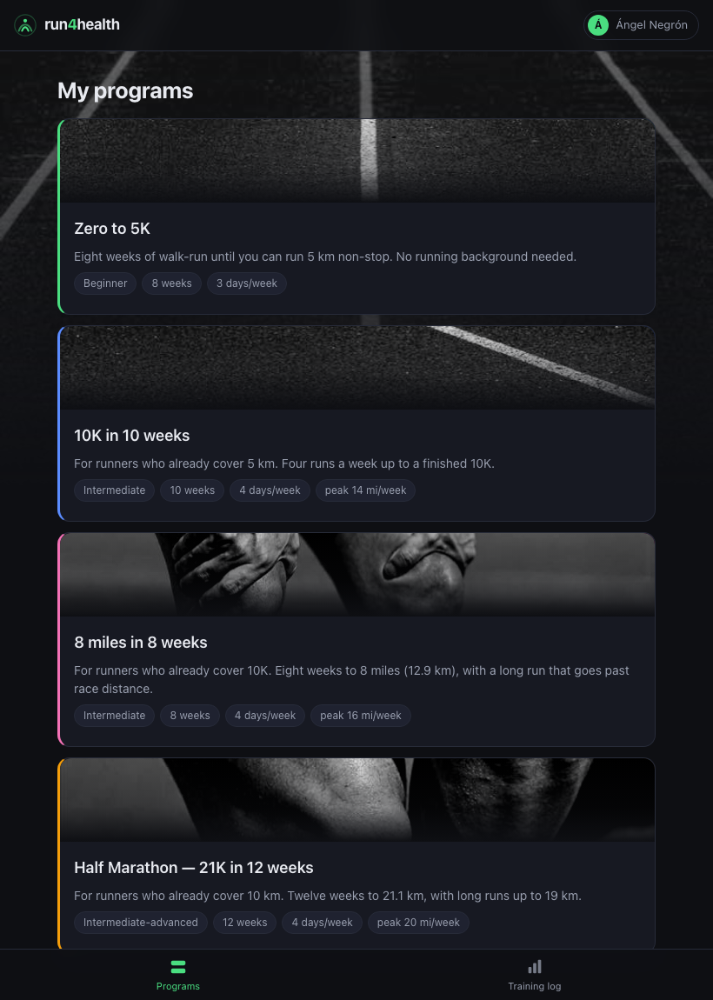
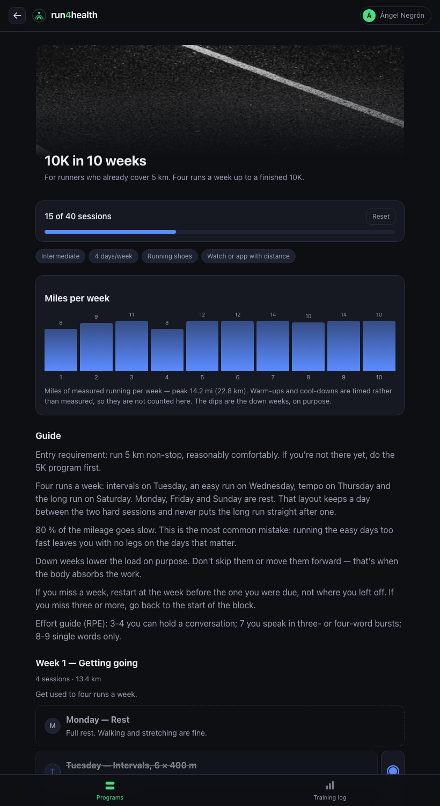

# run4health

A running app: four training programs, and a log of what you actually ran.

**[Try the demo →](https://anegronro.github.io/run4health/demo/)** — a frozen
copy of the real app. Click through the programs, open a session, look at the
training log. No sign-up.

<p>
  
  
</p>

Built for five friends who wanted to train for a race together. It runs on one
small server and it is in daily use.

## What it does

- **Four running programs** — 5K from scratch, 10K, 8 miles, half marathon.
  Every week is laid out Monday to Sunday, rest days included, so a plan reads
  as a calendar rather than a list of loose sessions.
- **Tick off each session** as you complete it. Everyone has their own account
  and their own progress.
- **A training log** — miles run, sessions completed, and a bar per week
  showing what you did against what the week planned.
- **Take your data or delete it**, without asking anyone. The download is a
  PDF you can read; a JSON file is there too, for actually moving elsewhere.

## Decisions worth explaining

**It works with JavaScript switched off, on purpose.** A content blocker on a
user's browser was letting the HTML through while blocking every subresource
from the host — stylesheet, script and photos all came back
`ERR_BLOCKED_BY_CLIENT`, so the app rendered as naked HTML. The same block
killed the `fetch()` behind the checkboxes, so ticking a session silently did
nothing. The fix was to remove the attack surface rather than fight it: the
stylesheet is inlined, the photos are `data:` URIs, and every action is a plain
form POST that redirects. There is now nothing left for a blocker to break.

**Passwords are hashed with scrypt** from the standard library, salted per
person. Sessions are random tokens stored only as hashes, so the same database
leak cannot be replayed as a login. Wrong password and unknown address return
the same message, so the form can't be used to discover who has an account.

**Backups are verified, not assumed.** Nightly, gzipped, fourteen days, using
sqlite3's own `.backup` rather than `cp` — copying the file mid-write captures
a torn page. Each copy is checked with `PRAGMA integrity_check` before the old
ones are pruned, and restoring one was tested on the server.

**Distance is read off the plan, never invented.** A session prescribed as
"20 min" contributes zero miles rather than a guess from an assumed pace.
Programs can be written in kilometres or miles; everything is summed in
kilometres and shown in miles.

**No third-party anything.** No analytics, no trackers, no CDN. Every page
loads only from its own server.

## Built with

Python · FastAPI · Jinja2 · SQLite · reportlab · systemd. No front-end
framework and no build step: the CSS is 400 lines and the pages are rendered
on the server.

## Run it

```bash
uv sync
uv run uvicorn app.main:app --port 8770 --reload
```

Then open <http://127.0.0.1:8770>. It creates its own database on first start;
`FITNESS_PASSWORD` puts a shared password in front of everything, and without
it the app is open, which is what you want locally.

## The content is yours

Every program is a JSON file under `data/programs/<lang>/`:

```
Program → weeks → days → blocks → exercises
```

| Field | Level | Notes |
|---|---|---|
| `name`, `description`, `level`, `equipment`, `color` | program | `color` is the card accent |
| `order` | program | listing order, lowest first |
| `art` | program | generated cover: `route`, `track` or `weights` |
| `guide` | program | long text; blank lines separate paragraphs |
| `number`, `title`, `goal` | week | |
| `title`, `focus`, `duration`, `notes` | day | `"rest_day": true` marks a rest day |
| `title`, `notes` | block | warm-up, main, cool-down… |
| `name`, `sets`, `reps`, `rest`, `tempo`, `rpe`, `notes`, `video` | exercise | free text |

A `reps` field that is only a distance — `5 km`, `400 m`, `8 mi` — counts
toward the week's mileage. Drop a photo at `app/static/img/<slug>.jpg` and that
program uses it as its cover, no configuration needed.

`scripts/new_program.py` writes the skeleton of a new one.

## Deploying it

`scripts/deploy_vps.sh` copies the app to a server and runs it under systemd,
installing the nightly backup into cron. Put your own host in
`scripts/deploy.env` — copy `deploy.env.example` — which is git-ignored, so no
address of yours ends up in a repository.

It expects a Debian-ish box with Python 3.11+ and `sqlite3`. Reaching it from
outside is your call: a private network, a reverse proxy, or a tunnel. If you
make it public, set `FITNESS_PASSWORD` first — the accounts inside are not a
substitute for a front door, and the password should not be guessable from the
project's own name.

`scripts/build_demo.py` freezes a running instance into the static demo linked
at the top.

## Still to come

Spanish throughout — the interface strings and the language column are in
place, the programs themselves are not translated yet. After that, recording a
run from the phone's GPS, which is the difference between a plan you read and
one that knows whether you ran.

## Licence

MIT — see [LICENSE](LICENSE). The photos are Angel's own.
